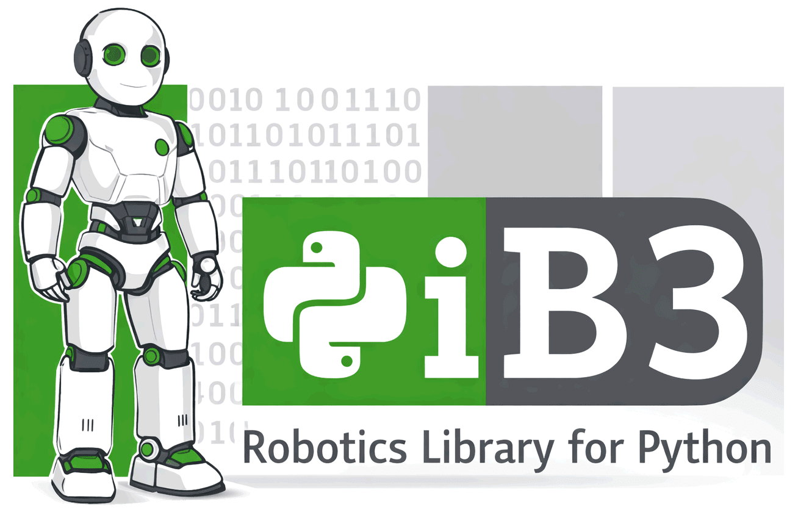

<h1 align="center">
<a href="https://ghloc.vercel.app/mamrehn/pib3?branch=main"></a>
</h1><br>

Repository statistics: 🐍 , 📜 , 🤖 

**piB3** provides motor control, inverse kinematics, and seamless code sharing between digital twin and the [pib](https://pib.rocks/) printable humanoid robot.

**Key Features:**

| | |
|---|---|
| 🔄 **Same Code Everywhere** | Test in Webots simulation, then run on real robot |
| 🎮 **Joint Control** | Read/write motors with IDE autocomplete via `Joint` enum |
| 📐 **Multiple Units** | Work in percent (0-100%), degrees, or radians |
| ✍️ **Trajectory Generation** | Convert 2-D images to 3-D robot arm drawing trajectories |
| 🖐️ **Hand Poses** | Pre-defined gestures or custom poses saved as JSON |
| 📷 **Camera Streaming** | Real-time camera image subscription |
| 🤖 **AI Vision** | On-device detection/segmentation with model switching |
| 📊 **IMU Sensors** | Accelerometer and gyroscope data streaming |

## Installation

```bash
python -m venv venv
venv\Scripts\activate  # OR on Linux: source ./venv/bin/activate
pip install -U "pib3 @ git+https://github.com/mamrehn/pib3.git"
```

### Windows prerequisites

If you are installing on Windows and encounter build or compilation errors (commonly when installing packages with native extensions such as `roboticstoolbox`), install the Microsoft Visual C++ Redistributable package first:

https://aka.ms/vc14/vc_redist.x64.exe  # for x64 architecture (default)
or
https://aka.ms/vc14/vc_redist.arm64.exe  # for ARM64 architecture (some newer Windows laptops)

if both do not work for you, try installing the [visual-cpp-build-tools](https://visualstudio.microsoft.com/de/visual-cpp-build-tools/) instead.


Also ensure `pip`, `setuptools`, and `wheel` are up-to-date before installing:

```bash
python -m pip install --upgrade pip setuptools wheel
```

Installing the build tools and upgrading these packaging utilities often resolves common Windows installation issues.

## Quick Start

### Digital Twin - Same Code Everywhere

```python
import pib3

# Same API works on all backends

with pib3.Webots() as sim:             # Webots simulation
    sim.run_trajectory("output.json")

with pib3.Robot(host="...") as robot:  # Real robot
    robot.run_trajectory("output.json")
```

### Joint Control

```python
from pib3 import Robot, Joint

with Robot(host="172.26.34.149") as robot:
    # Set joints with IDE autocomplete
    robot.set_joint(Joint.TURN_HEAD, 50.0)    # 50% of range
    robot.set_joint(Joint.ELBOW_LEFT, 75.0)

    # Read current position
    pos = robot.get_joint(Joint.ELBOW_LEFT)
    print(f"Left elbow at {pos:.1f}%")

    # Use degrees or radians
    robot.set_joint(Joint.TURN_HEAD, -30.0, unit="deg")

    # Wait for movement to complete
    robot.set_joint(Joint.ELBOW_LEFT, 50.0, async_=False)

    # Save and restore poses
    saved_pose = robot.get_joints()
    robot.set_joints(saved_pose)
```

### Hand Poses

```python
from pib3 import Robot, HandPose, LEFT_HAND_JOINTS

with Robot(host="172.26.34.149") as robot:
    robot.set_joints(HandPose.LEFT_OPEN)                    # Open hand
    robot.set_joints(HandPose.LEFT_CLOSED)                  # Close hand
    robot.set_joints({j: 50.0 for j in LEFT_HAND_JOINTS})   # 50% grip
```

### Image to Drawing Trajectory

```python
import pib3

trajectory = pib3.generate_trajectory("drawing.png")
trajectory.to_json("output.json")


```

### Camera & AI Vision

```python
from pib3 import Robot

with Robot(host="172.26.34.149") as robot:
    # Stream camera frames
    sub = robot.subscribe_camera_image(lambda jpeg: print(f"{len(jpeg)} bytes"))
    sub.unsubscribe()

    # AI object detection
    def on_detection(data):
        for det in data.get('result', {}).get('detections', []):
            print(f"{det['label']}: {det['confidence']:.0%}")
    
    sub = robot.subscribe_ai_detections(on_detection)
```

### IMU Sensors

```python
from pib3 import Robot

with Robot(host="172.26.34.149") as robot:
    def on_imu(data):
        accel = data['linear_acceleration']
        print(f"Accel: ({accel['x']:.2f}, {accel['y']:.2f}, {accel['z']:.2f}) m/s²")
    
    robot.set_imu_frequency(50)
    sub = robot.subscribe_imu(on_imu, data_type="full")
```

## Documentation

Full documentation: **[mamrehn.github.io/pib3](https://mamrehn.github.io/pib3/)**

- [Installation Guide](https://mamrehn.github.io/pib3/getting-started/installation/) - Setup for Linux/Windows
- [Quick Start](https://mamrehn.github.io/pib3/getting-started/quickstart/) - Basic usage examples
- [Calibration Guide](https://mamrehn.github.io/pib3/getting-started/calibration/) - Configure joint limits
- [API Reference](https://mamrehn.github.io/pib3/api/) - Complete API documentation
- [Tutorials](https://mamrehn.github.io/pib3/tutorials/) - Step-by-step guides

## Acknowledgments

- [PIB Project](https://pib.rocks/) - Open source humanoid robot
- [Robotics Toolbox for Python](https://github.com/petercorke/robotics-toolbox-python)
