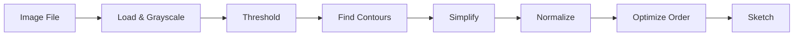

# Image Processing

Functions for converting images to sketches.

## Overview

The image processing module converts raster images to vector strokes suitable for robot drawing.



## Main Function

::: pib3.image.image_to_sketch
    options:
      show_root_heading: true
      show_source: true

### Basic Usage

```python
import pib3

# From file path
sketch = pib3.image_to_sketch("drawing.png")

# From Path object
from pathlib import Path
sketch = pib3.image_to_sketch(Path("images/drawing.png"))

# With custom config
from pib3 import ImageConfig
config = ImageConfig(threshold=100, simplify_tolerance=3.0)
sketch = pib3.image_to_sketch("sketch.jpg", config)
```

### Input Formats

```python
import numpy as np
from PIL import Image
import pib3

# From file path (string or Path)
sketch = pib3.image_to_sketch("drawing.png")

# From NumPy array (grayscale)
gray = np.zeros((100, 100), dtype=np.uint8)
gray[25:75, 25:75] = 255
sketch = pib3.image_to_sketch(gray)

# From NumPy array (RGB)
rgb = np.zeros((100, 100, 3), dtype=np.uint8)
sketch = pib3.image_to_sketch(rgb)

# From NumPy array (RGBA with transparency)
rgba = np.zeros((100, 100, 4), dtype=np.uint8)
sketch = pib3.image_to_sketch(rgba)

# From PIL Image
pil_img = Image.open("drawing.png")
sketch = pib3.image_to_sketch(pil_img)
```

### Processing Steps

1. **Load**: Accept file path, numpy array, or PIL Image
2. **Grayscale**: Convert to single channel
3. **Threshold**: Binary black/white conversion
4. **Contours**: Extract edges using scikit-image or OpenCV
5. **Simplify**: Douglas-Peucker algorithm reduces points
6. **Filter**: Remove small/short contours
7. **Normalize**: Scale coordinates to [0, 1]
8. **Optimize**: Reorder to minimize pen travel

### Handling Different Images

```python
from pib3 import ImageConfig, image_to_sketch

# Clean black-on-white
config = ImageConfig(threshold=128, auto_foreground=True)

# Light pencil sketch
config = ImageConfig(threshold=200, simplify_tolerance=3.0)

# High detail
config = ImageConfig(simplify_tolerance=0.5, min_contour_length=5)

# Noisy/low quality
config = ImageConfig(
    simplify_tolerance=4.0,
    min_contour_length=20,
    min_contour_points=5
)
```

### Output

Returns a `Sketch` object containing:

- List of `Stroke` objects with normalized coordinates
- Source image dimensions (if available)

```python
sketch = pib3.image_to_sketch("drawing.png")

print(f"Strokes extracted: {len(sketch)}")
print(f"Total points: {sketch.total_points()}")
print(f"Source size: {sketch.source_size}")
```

## Dependencies

Image processing requires one of:

- **scikit-image** (preferred): `pip install scikit-image`
- **OpenCV**: `pip install opencv-python`

Install with image extras:

```bash
pip install "pib-ik[image] @ git+https://github.com/mamrehn/pib3.git"
```
