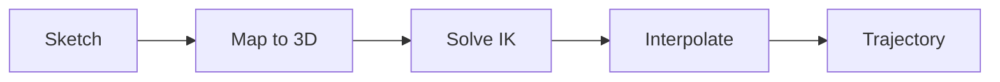

# Trajectory Generation

Functions and classes for generating robot trajectories.

## Overview

Trajectory generation converts 2D sketches to 3D robot joint positions using inverse kinematics.



## Main Function

### generate_trajectory

::: pib_ik.generate_trajectory
    options:
      show_root_heading: true
      show_source: true

### Usage

```python
import pib_ik

# Basic usage
trajectory = pib_ik.generate_trajectory("drawing.png")
trajectory.to_json("output.json")

# With configuration
from pib_ik import TrajectoryConfig, PaperConfig
config = TrajectoryConfig(
    paper=PaperConfig(size=0.15, drawing_scale=0.9)
)
trajectory = pib_ik.generate_trajectory("drawing.png", config=config)

# With visualization during IK solving
trajectory = pib_ik.generate_trajectory(
    "drawing.png",
    visualize=True  # Opens Swift browser view
)
```

---

## sketch_to_trajectory

::: pib_ik.trajectory.sketch_to_trajectory
    options:
      show_root_heading: true
      show_source: true

### Usage

```python
import pib_ik

# Step-by-step approach
sketch = pib_ik.image_to_sketch("drawing.png")
trajectory = pib_ik.sketch_to_trajectory(sketch)

# With progress callback
def on_progress(current, total, success):
    print(f"Point {current}/{total}: {'OK' if success else 'FAIL'}")

trajectory = pib_ik.sketch_to_trajectory(
    sketch,
    progress_callback=on_progress
)

# With custom config
from pib_ik import TrajectoryConfig
config = TrajectoryConfig(...)
trajectory = pib_ik.sketch_to_trajectory(sketch, config)
```

---

## Trajectory Class

::: pib_ik.trajectory.Trajectory
    options:
      show_root_heading: true
      show_source: true
      members:
        - __init__
        - __len__
        - to_json
        - from_json
        - to_webots_format
        - to_robot_format

### Creating Trajectories

```python
import numpy as np
from pib_ik import Trajectory

# From arrays
joint_names = ["joint_0", "joint_1", "joint_2"]
waypoints = np.array([
    [0.0, 0.0, 0.0],
    [0.1, 0.2, 0.3],
    [0.2, 0.4, 0.6],
])

trajectory = Trajectory(
    joint_names=joint_names,
    waypoints=waypoints,
    metadata={"source": "custom"}
)
```

### Saving and Loading

```python
from pib_ik import Trajectory

# Save to JSON
trajectory.to_json("my_trajectory.json")

# Load from JSON
loaded = Trajectory.from_json("my_trajectory.json")

# Access data
print(f"Waypoints: {len(loaded)}")
print(f"Joints: {loaded.joint_names}")
print(f"Metadata: {loaded.metadata}")
```

### Format Conversion

```python
# Get waypoints in Webots format (no offset, canonical format)
webots_waypoints = trajectory.to_webots_format()

# Get waypoints in Swift format (-1.0 offset)
swift_waypoints = trajectory.to_swift_format()

# Get waypoints in robot format (centidegrees)
robot_waypoints = trajectory.to_robot_format()
```

### JSON Format

```json
{
  "format_version": "1.0",
  "unit": "radians",
  "coordinate_frame": "webots",
  "joint_names": ["turn_head_motor", "tilt_forward_motor", ...],
  "waypoints": [
    [0.1, 0.2, 0.3, ...],
    [0.15, 0.25, 0.35, ...]
  ],
  "metadata": {
    "source": "pib_ik",
    "robot_model": "pib",
    "success_rate": 0.95,
    "created_at": "2024-01-01T12:00:00Z"
  }
}
```

---

## IK Solver Details

The inverse kinematics solver uses:

- **Algorithm**: Damped Least Squares (DLS) gradient descent
- **Convergence**: Position error below tolerance
- **Limits**: Joint limits enforced during solving
- **Fallback**: Linear interpolation for failed points

### Solver Parameters

| Parameter | Effect |
|-----------|--------|
| `max_iterations` | More iterations = better accuracy, slower |
| `tolerance` | Smaller = more precise, harder to converge |
| `step_size` | Larger = faster convergence, risk of oscillation |
| `damping` | Higher = more stable near singularities |
