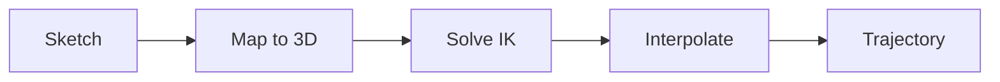

# Trajectory Generation

Functions and classes for generating robot trajectories.

## Overview

Trajectory generation converts 2D sketches to 3D robot joint positions using inverse kinematics.


```mermaid
graph LR
    A[Sketch] --> B[Map to 3D]
    B --> C[Solve IK]
    C --> D[Interpolate]
    D --> E[Trajectory]
```

## Main Function

### generate_trajectory

::: pib3.generate_trajectory
    options:
      show_root_heading: true
      show_source: true

### Usage

```python
import pib3

# Basic usage
trajectory = pib3.generate_trajectory("drawing.png")
trajectory.to_json("output.json")

# With configuration
from pib3 import TrajectoryConfig, PaperConfig
config = TrajectoryConfig(
    paper=PaperConfig(size=0.15, drawing_scale=0.9)
)
trajectory = pib3.generate_trajectory("drawing.png", config=config)

# Save directly while generating
trajectory = pib3.generate_trajectory("drawing.png", output_path="output.json")

# Sequential trajectories: start each IK from the previous trajectory's end pose
traj1 = pib3.generate_trajectory("image1.png")
traj2 = pib3.generate_trajectory("image2.png", initial_q=traj1)
```

---

## sketch_to_trajectory

::: pib3.trajectory.sketch_to_trajectory
    options:
      show_root_heading: true
      show_source: true

### Usage

```python
import pib3

# Step-by-step approach
sketch = pib3.image_to_sketch("drawing.png")
trajectory = pib3.sketch_to_trajectory(sketch)

# With progress callback
def on_progress(current, total, success):
    print(f"Point {current}/{total}: {'OK' if success else 'FAIL'}")

trajectory = pib3.sketch_to_trajectory(
    sketch,
    progress_callback=on_progress
)

# With custom config
from pib3 import TrajectoryConfig
config = TrajectoryConfig(...)
trajectory = pib3.sketch_to_trajectory(sketch, config)
```

---

## Trajectory Class

::: pib3.trajectory.Trajectory
    options:
      show_root_heading: true
      show_source: true
      members:
        - __init__
        - __len__
        - to_json
        - from_json
        - to_webots_format
        - to_robot_format

### Creating Trajectories

```python
import numpy as np
from pib3 import Trajectory

# From arrays
joint_names = ["joint_0", "joint_1", "joint_2"]
waypoints = np.array([
    [0.0, 0.0, 0.0],
    [0.1, 0.2, 0.3],
    [0.2, 0.4, 0.6],
])

trajectory = Trajectory(
    joint_names=joint_names,
    waypoints=waypoints,
    metadata={"source": "custom"}
)
```

### Saving and Loading

```python
from pib3 import Trajectory

# Save to JSON
trajectory.to_json("my_trajectory.json")

# Load from JSON
loaded = Trajectory.from_json("my_trajectory.json")

# Access data
print(f"Waypoints: {len(loaded)}")
print(f"Joints: {loaded.joint_names}")
print(f"Metadata: {loaded.metadata}")
```

### Format Conversion

```python
# Get waypoints in Webots format (no offset, canonical format)
webots_waypoints = trajectory.to_webots_format()


# Get waypoints in robot format (centidegrees)
robot_waypoints = trajectory.to_robot_format()
```

!!! warning "`to_robot_format()` is a raw unit conversion"
    It only converts radians → centidegrees; it does **not** apply the
    per-backend finger-convention remap. For correct playback on the real robot
    use `RealRobotBackend.run_trajectory(traj)`, which remaps finger joints
    before sending.

### JSON Format

```json
{
  "format_version": "1.0",
  "unit": "radians",
  "coordinate_frame": "webots",
  "joint_names": ["turn_head_motor", "tilt_forward_motor", ...],
  "waypoints": [
    [0.1, 0.2, 0.3, ...],
    [0.15, 0.25, 0.35, ...]
  ],
  "metadata": {
    "source": "pib3",
    "robot_model": "pib",
    "success_rate": 0.95,
    "created_at": "2024-01-01T12:00:00Z"
  }
}
```

### Schema Validation

`Trajectory.from_json()` validates the file and raises a clear error instead of silently accepting malformed data:

| Check | Failure mode |
|-------|--------------|
| Top level is a `dict` | `ValueError` |
| `format_version` matches supported | warning logged |
| `unit` equals the expected value | `ValueError` on mismatch |
| `joint_names` is a `list[str]` | `ValueError` |
| `waypoints` is a 2D numeric array with columns matching `len(joint_names)` | `ValueError` |
| `metadata` is a `dict` | `ValueError` |

This keeps downstream execution from failing deep inside IK or motor code with opaque `IndexError`/`KeyError` tracebacks.

---

## IK Solver Details

The inverse kinematics solver uses:

- **Algorithm**: Levenberg-Marquardt via roboticstoolbox `ikine_LM`, on the
  expert-calibrated DH model (with `base` + `tool`). Targets are solved in the
  **torso frame, in millimetres**; the returned joint degrees map directly to
  motor commands.
- **Robustness**: Each point is attempted in layers (warm-start → ignore joint
  limits → random restarts), first success wins. This recovers many poses that a
  single limited solve would report as failures.
- **Convergence**: Position error below `tolerance`.
- **Fallback**: Linear interpolation for points that still fail.

### Solver Parameters

| Parameter | Effect |
|-----------|--------|
| `max_iterations` | Iterations per search attempt (`ikine_LM` ilimit). |
| `slimit` | Random-restart attempts per point. Higher = more poses solved, slower on hard targets. |
| `tolerance` | Position tolerance (m). Smaller = more precise, harder to converge. |

### Validating the IK

Before driving real motors, sanity-check the IK **offline** (no hardware) with
[`verify_ik`](kinematics.md#validating-inverse-kinematics). It solves a
torso-frame target, runs forward kinematics on the result, and returns the
round-trip position error:

```python
from pib3 import verify_ik

q_deg, error_mm, ok = verify_ik("left", [150, 0, 350])  # torso-frame mm
print(ok, round(error_mm, 3), q_deg)  # expect ok=True, sub-mm error
```
