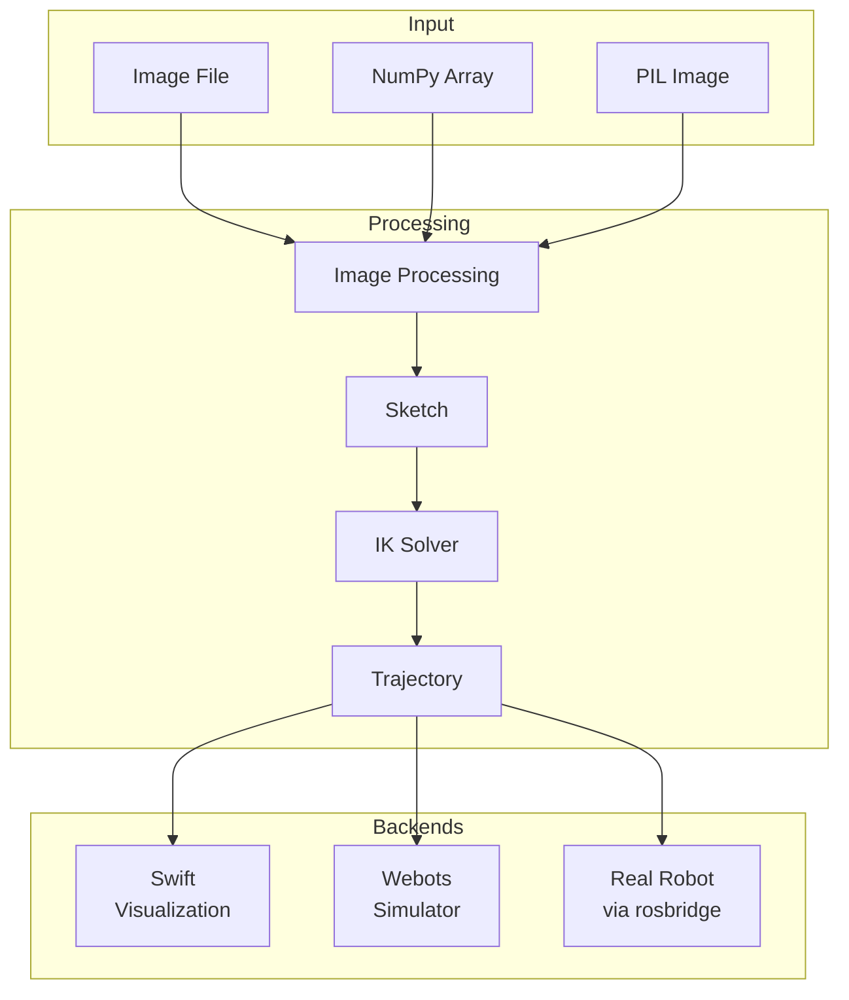
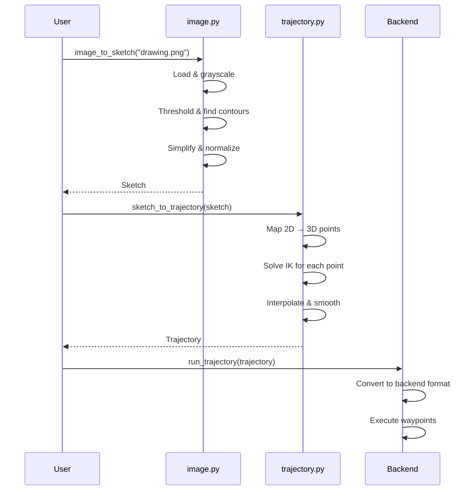

# Architecture Overview

High-level design of the pib-ik library.

## Design Goals

1. **Simple API**: One-liner for common tasks
2. **Modular**: Components can be used independently
3. **Backend-agnostic**: Same code works with real robot, simulator, or visualization
4. **Well-documented**: Clear examples and comprehensive docs

## System Architecture



## Package Structure

```
pib3/
├── __init__.py          # Public API exports
├── config.py            # Configuration dataclasses
├── types.py             # Core types (Stroke, Sketch)
├── image.py             # Image → Sketch conversion
├── trajectory.py        # Sketch → Trajectory + IK solver
├── backends/
│   ├── base.py          # RobotBackend ABC
│   ├── swift.py         # Browser visualization
│   ├── webots.py        # Webots simulator
│   └── robot.py         # Real robot (rosbridge)
├── tools/
│   └── proto_converter.py  # Webots proto → URDF
└── resources/
    └── pib_model.urdf   # Robot kinematic model
```

## Data Flow

### Image to Trajectory Pipeline



## Core Components

### Sketch & Stroke

The fundamental data types for representing drawings:

```python
@dataclass
class Point:
    x: float  # 0.0 to 1.0 (normalized)
    y: float  # 0.0 to 1.0 (normalized)

@dataclass
class Stroke:
    points: List[Point]  # Ordered points in one stroke

@dataclass
class Sketch:
    strokes: List[Stroke]  # Collection of strokes
```

All coordinates are normalized to [0, 1] for resolution independence.

### Trajectory

Joint-space representation of robot motion:

```python
@dataclass
class Trajectory:
    joint_names: List[str]      # 26 joint names
    waypoints: np.ndarray       # Shape: (N, 26) in radians
    metadata: Dict[str, Any]    # Source info, timestamps, etc.
```

### Backend Interface

All backends implement the same interface:

```python
class RobotBackend(ABC):
    # Connection management
    def connect(self) -> None: ...
    def disconnect(self) -> None: ...
    @property
    def is_connected(self) -> bool: ...

    # Single joint control
    def set_joint(self, name: str, position: float, unit: str = "percent") -> bool: ...
    def get_joint(self, name: str, unit: str = "percent") -> Optional[float]: ...

    # Multiple joint control
    def set_joints(self, positions: Dict[str, float], unit: str = "percent") -> bool: ...
    def get_joints(self, names: Optional[List[str]] = None, unit: str = "percent") -> Dict[str, float]: ...

    # Trajectory execution
    def run_trajectory(self, trajectory: Trajectory, rate_hz: float = 20.0) -> bool: ...
```

See the [Base Backend API](../api/backends/base.md) for complete method documentation.

## IK Solver

The inverse kinematics solver converts Cartesian end-effector positions to joint angles.

### Algorithm

1. **Jacobian Computation**: Calculate the geometric Jacobian for the kinematic chain from base to left index finger tip
2. **Damped Least Squares**: Solve `Δq = J^T (JJ^T + λI)^{-1} Δx` for numerical stability
3. **Iterative Refinement**: Repeat until position error < tolerance or max iterations
4. **Joint Limits**: Clamp solutions to valid ranges

### Kinematic Chain

The solver uses the left arm chain for drawing:

```
base_link
  └─ shoulder_vertical_left
       └─ shoulder_horizontal_left
            └─ upper_arm_left_rotation
                 └─ elbow_left
                      └─ lower_arm_left_rotation
                           └─ wrist_left
                                └─ index_left_stretch (end effector)
```

### Configuration

```python
from pib3 import IKConfig

config = IKConfig(
    max_iterations=100,
    tolerance=0.001,    # 1mm
    damping=0.1,
    step_size=0.5,
)
```

## Configuration System

All configurable parameters use dataclasses:

```python
@dataclass
class TrajectoryConfig:
    paper: PaperConfig
    ik: IKConfig

@dataclass
class PaperConfig:
    center_x: float = 0.15
    center_y: float = 0.15
    height_z: float = 0.74
    size: float = 0.12

@dataclass
class IKConfig:
    max_iterations: int = 100
    tolerance: float = 0.001
    damping: float = 0.1
```

## Error Handling

The library uses a fail-soft approach:

1. **IK failures**: Points that fail to solve are interpolated from neighbors
2. **Connection failures**: Clear error messages with troubleshooting hints
3. **Invalid input**: Validated early with descriptive exceptions

```python
# IK progress shows success/failure per point
def on_progress(current, total, success):
    status = "✓" if success else "✗"
    print(f"{status} Point {current}/{total}")

trajectory = pib3.sketch_to_trajectory(
    sketch,
    progress_callback=on_progress,
)

# Check overall success rate
print(f"Success rate: {trajectory.metadata['success_rate']:.1%}")
```
