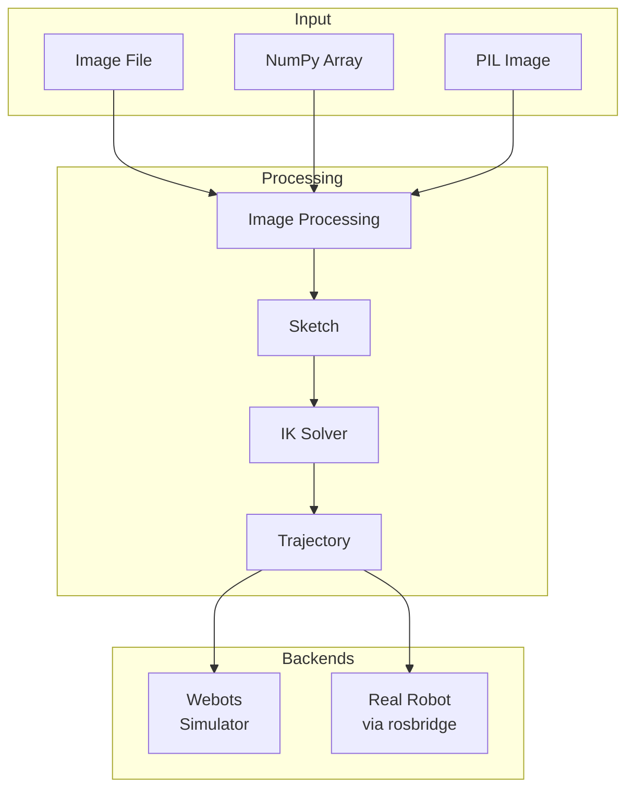
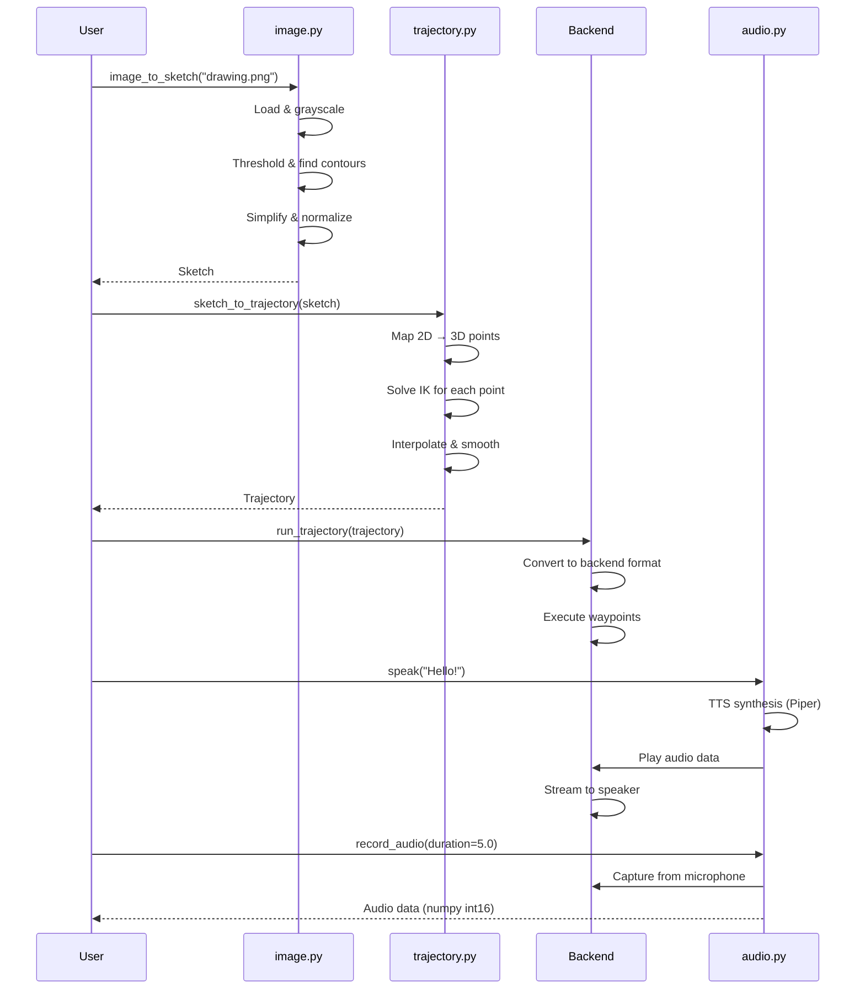

# Architecture Overview

High-level design of the pib3 library.

## Design Goals

1. **Simple API**: One-liner for common tasks
2. **Modular**: Components can be used independently
3. **Backend-agnostic**: Same code works with real robot, simulator, or visualization
4. **Well-documented**: Clear examples and comprehensive docs

## System Architecture


```mermaid
graph TB
    subgraph Input
        IMG[Image File]
        ARR[NumPy Array]
        PIL[PIL Image]
    end

    subgraph Processing
        IMG --> IP[Image Processing]
        ARR --> IP
        PIL --> IP
        IP --> SK[Sketch]
        SK --> IK[IK Solver]
        IK --> TJ[Trajectory]
    end

    subgraph Backends

        TJ --> WB[Webots<br/>Simulator]
        TJ --> RR[Real Robot<br/>via rosbridge]
    end
```

## Package Structure

```
pib3/
├── __init__.py          # Public API exports
├── config.py            # Configuration dataclasses
├── types.py             # Core types (Stroke, Sketch)
├── image.py             # Image → Sketch conversion
├── trajectory.py        # Sketch → Trajectory + IK solver
├── audio.py             # Audio playback, recording, TTS
├── backends/
│   ├── base.py          # RobotBackend ABC
│   ├── webots.py        # Webots simulator
│   └── robot.py         # Real robot (rosbridge)
├── tools/
│   └── proto_converter.py  # Webots proto → URDF
└── resources/
    └── pib_model.urdf   # Robot kinematic model
```

## Data Flow

### Image to Trajectory Pipeline


```mermaid
sequenceDiagram
    participant User
    participant image.py
    participant trajectory.py
    participant Backend
    participant audio.py

    User->>image.py: image_to_sketch("drawing.png")
    image.py->>image.py: Load & grayscale
    image.py->>image.py: Threshold & find contours
    image.py->>image.py: Simplify & normalize
    image.py-->>User: Sketch

    User->>trajectory.py: sketch_to_trajectory(sketch)
    trajectory.py->>trajectory.py: Map 2D → 3D points
    trajectory.py->>trajectory.py: Solve IK for each point
    trajectory.py->>trajectory.py: Interpolate & smooth
    trajectory.py-->>User: Trajectory

    User->>Backend: run_trajectory(trajectory)
    Backend->>Backend: Convert to backend format
    Backend->>Backend: Execute waypoints

    User->>audio.py: speak("Hello!")
    audio.py->>audio.py: TTS synthesis (Piper)
    audio.py->>Backend: Play audio data
    Backend->>Backend: Stream to speaker

    User->>audio.py: record_audio(duration=5.0)
    audio.py->>Backend: Capture from microphone
    audio.py-->>User: Audio data (numpy int16)
```

## Core Components

### Sketch & Stroke

The fundamental data types for representing drawings:

```python
@dataclass
class Point:
    x: float  # 0.0 to 1.0 (normalized)
    y: float  # 0.0 to 1.0 (normalized)

@dataclass
class Stroke:
    points: List[Point]  # Ordered points in one stroke

@dataclass
class Sketch:
    strokes: List[Stroke]  # Collection of strokes
```

All coordinates are normalized to [0, 1] for resolution independence.

### Trajectory

Joint-space representation of robot motion:

```python
@dataclass
class Trajectory:
    joint_names: List[str]      # 26 joint names
    waypoints: np.ndarray       # Shape: (N, 26) in radians
    metadata: Dict[str, Any]    # Source info, timestamps, etc.
```

### Backend Interface

All backends implement the same interface:

```python
from pib3 import Joint

class RobotBackend(ABC):
    # Connection
    def connect(self) -> None: ...
    def disconnect(self) -> None: ...

    # Joint control (accepts Joint enum or str)
    def set_joint(self, name: Joint | str, position: float, unit: str = "percent") -> bool: ...
    def get_joint(self, name: Joint | str, unit: str = "percent") -> Optional[float]: ...
    def set_joints(self, positions: Dict[Joint | str, float], unit: str = "percent") -> bool: ...
    def get_joints(self, names: List[Joint | str] = None, unit: str = "percent") -> Dict[str, float]: ...

    # Trajectory
    def run_trajectory(self, trajectory: Trajectory, rate_hz: float = 20.0) -> bool: ...

    # Audio
    def speak(self, text: str, output: AudioOutput = AudioOutput.ROBOT) -> None: ...
    def play_audio(self, audio_data: np.ndarray, output: AudioOutput = AudioOutput.ROBOT) -> None: ...
    def record_audio(self, duration: float, input_source: AudioInput = AudioInput.LOCAL) -> np.ndarray: ...
```

See the [Base Backend API](../api/backends/base.md) for complete documentation.

## IK Solver

The inverse kinematics solver converts Cartesian end-effector positions to joint angles.

### Algorithm

The solver uses the expert-calibrated **DH model** for each arm (from
`pib3.dh_model`), which carries a `base` transform (torso → shoulder) and a
`tool` transform (wrist → drawing tip). Targets are expressed in the **torso
frame, in millimetres**, matching the expert pib-sdk.

1. **Target**: Map each 2-D sketch point to a 3-D torso-frame point on the paper plane.
2. **Solve**: roboticstoolbox `ikine_LM` (Levenberg-Marquardt) on the 6 arm joints (position-only mask).
3. **Layered retries**: warm-start → ignore joint limits → random restarts; first success wins. This recovers reachable poses that a single limited solve would reject.
4. **Fallback**: linearly interpolate any points that still fail.

The solved joint angles are in the motor convention — **degrees map directly to
motor commands** (no per-joint sign/offset). Validate offline with
[`verify_ik`](../api/kinematics.md#validating-inverse-kinematics).

### Kinematic Chain

The DH solver actuates only the 6 arm joints; the `base` and `tool` transforms
bracket them. Finger joints are **not** part of the chain — they stay at a fixed
grip pose, and the drawing tip is reached via the `tool` transform.

```
torso frame
  └─ base  (torso → shoulder)
       └─ shoulder_vertical_left
            └─ shoulder_horizontal_left
                 └─ upper_arm_left_rotation
                      └─ elbow_left
                           └─ lower_arm_left_rotation
                                └─ wrist_left
                                     └─ tool  (→ drawing tip = end effector)
```

### Configuration

```python
from pib3 import IKConfig

config = IKConfig(
    max_iterations=100,   # ikine_LM iterations per attempt
    slimit=100,           # random-restart attempts per point
    tolerance=0.001,      # 1 mm
)
```

## Configuration System

All configurable parameters use dataclasses:

```python
@dataclass
class TrajectoryConfig:
    paper: PaperConfig
    ik: IKConfig

@dataclass
class PaperConfig:  # torso frame, metres; None fields are auto-placed
    start_x: Optional[float] = None
    center_y: Optional[float] = None
    height_z: Optional[float] = None
    size: float = 0.10

@dataclass
class IKConfig:
    max_iterations: int = 300
    slimit: int = 100
    tolerance: float = 0.002
```

## Error Handling

The library uses a fail-soft approach:

1. **IK failures**: Points that fail to solve are interpolated from neighbors
2. **Connection failures**: Clear error messages with troubleshooting hints
3. **Invalid input**: Validated early with descriptive exceptions

```python
# IK progress shows success/failure per point
def on_progress(current, total, success):
    status = "✓" if success else "✗"
    print(f"{status} Point {current}/{total}")

trajectory = pib3.sketch_to_trajectory(
    sketch,
    progress_callback=on_progress,
)

# Check overall success rate
print(f"Success rate: {trajectory.metadata['success_rate']:.1%}")
```
