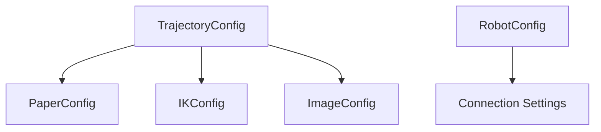

# Custom Configurations

Fine-tune all parameters for optimal results.

## Objectives

By the end of this tutorial, you will:

- Understand all configuration options
- Customize paper/drawing surface settings
- Tune the IK solver for better results
- Optimize image processing parameters
- Create reusable configuration profiles

## Prerequisites

- pib-ik installed: `pip install git+https://github.com/mamrehn/pib3.git`
- Understanding of basic trajectory generation

---

## Configuration Overview

pib-ik uses four configuration classes:



| Config Class | Purpose |
|--------------|---------|
| `TrajectoryConfig` | Main config combining all others |
| `PaperConfig` | Drawing surface position and size |
| `IKConfig` | Inverse kinematics solver settings |
| `ImageConfig` | Image processing parameters |
| `RobotConfig` | Robot connection settings |

---

## TrajectoryConfig

The main configuration that combines everything:

```python
from pib3 import TrajectoryConfig, PaperConfig, IKConfig, ImageConfig

config = TrajectoryConfig(
    paper=PaperConfig(...),   # Paper settings
    ik=IKConfig(...),         # IK solver settings
    image=ImageConfig(...),   # Image processing settings
    point_density=0.01,       # Path interpolation density
)
```

### Point Density

Controls how finely paths are interpolated:

```python
# Coarse (faster, fewer waypoints)
config = TrajectoryConfig(point_density=0.05)

# Fine (smoother, more waypoints)
config = TrajectoryConfig(point_density=0.005)
```

Lower values = smoother motion but more waypoints.

---

## PaperConfig

Configure the drawing surface position and size:

```python
from pib3 import PaperConfig

paper = PaperConfig(
    start_x=0.10,        # Paper front edge X position (meters)
    size=0.12,           # Paper width/height (meters, assumes square)
    height_z=0.74,       # Table/paper height (meters)
    center_y=None,       # Paper center Y (None = auto-calculate)
    drawing_scale=0.8,   # Use 80% of paper area
    lift_height=0.03,    # Pen lift between strokes (meters)
)
```

### Parameter Details

| Parameter | Default | Description |
|-----------|---------|-------------|
| `start_x` | 0.10 | Distance from robot base to paper front edge |
| `size` | 0.12 | Paper size (12cm x 12cm default) |
| `height_z` | 0.74 | Vertical position of paper surface |
| `center_y` | None | Left/right position (None = auto from arm reach) |
| `drawing_scale` | 0.8 | Scale factor within paper bounds |
| `lift_height` | 0.03 | How high to lift pen between strokes |

### Common Adjustments

```python
# Larger paper, closer to robot
paper = PaperConfig(
    start_x=0.08,
    size=0.20,
    drawing_scale=0.9,
)

# Smaller paper, higher table
paper = PaperConfig(
    size=0.10,
    height_z=0.80,
)

# Specific position (not auto-calculated)
paper = PaperConfig(
    center_y=0.18,  # Fixed left/right position
)
```

---

## IKConfig

Tune the inverse kinematics solver:

```python
from pib3 import IKConfig

ik = IKConfig(
    max_iterations=150,  # Max gradient descent iterations
    tolerance=0.002,     # Position tolerance (meters)
    step_size=0.4,       # Gradient descent step size
    damping=0.01,        # Damping for numerical stability
    arm="left",          # Which arm to use
)
```

### Parameter Details

| Parameter | Default | Description |
|-----------|---------|-------------|
| `max_iterations` | 150 | Maximum solver iterations per point |
| `tolerance` | 0.002 | Success if within 2mm of target |
| `step_size` | 0.4 | How far to move each iteration |
| `damping` | 0.01 | Prevents oscillation near singularities |
| `arm` | "left" | Drawing arm ("left" or "right") |

### Tuning for Better Results

```python
# More accurate (slower)
ik = IKConfig(
    max_iterations=300,
    tolerance=0.001,  # 1mm accuracy
    step_size=0.2,    # Smaller steps
)

# Faster (less accurate)
ik = IKConfig(
    max_iterations=50,
    tolerance=0.005,  # 5mm accuracy
    step_size=0.6,    # Larger steps
)

# For difficult poses (near singularities)
ik = IKConfig(
    damping=0.05,     # More damping
    step_size=0.2,    # Careful steps
)
```

---

## ImageConfig

Control image processing and contour extraction:

```python
from pib3 import ImageConfig

image = ImageConfig(
    threshold=128,            # Black/white threshold (0-255)
    auto_foreground=True,     # Auto-detect foreground color
    simplify_tolerance=2.0,   # Douglas-Peucker simplification
    min_contour_length=10,    # Minimum contour length (pixels)
    min_contour_points=3,     # Minimum points per contour
    margin=0.05,              # Border margin (normalized)
    optimize_path_order=True, # Minimize pen travel
)
```

### Parameter Details

| Parameter | Default | Description |
|-----------|---------|-------------|
| `threshold` | 128 | Pixel values below this are foreground |
| `auto_foreground` | True | Detect minority pixels as foreground |
| `simplify_tolerance` | 2.0 | Higher = simpler contours |
| `min_contour_length` | 10 | Filter contours shorter than this |
| `min_contour_points` | 3 | Minimum vertices after simplification |
| `margin` | 0.05 | Padding from edges (5%) |
| `optimize_path_order` | True | Reorder for efficient drawing |

### Tuning for Different Images

```python
# Clean black-on-white drawings
image = ImageConfig(
    threshold=128,
    auto_foreground=True,
)

# Light pencil sketches
image = ImageConfig(
    threshold=200,  # More sensitive
    simplify_tolerance=3.0,
)

# Detailed images
image = ImageConfig(
    simplify_tolerance=0.5,
    min_contour_length=5,
)

# Noisy images
image = ImageConfig(
    simplify_tolerance=4.0,
    min_contour_length=20,
)
```

---

## RobotConfig

Configure robot connection (for `Robot.from_config()`):

```python
from pib3 import RobotConfig
from pib3.backends import RealRobotBackend

robot_config = RobotConfig(
    host="172.26.34.149",
    port=9090,
    timeout=5.0,
)

robot = RealRobotBackend.from_config(robot_config)
```

---

## Complete Configuration Profiles

### Profile: High Quality

```python
from pib3 import TrajectoryConfig, PaperConfig, IKConfig, ImageConfig

HIGH_QUALITY = TrajectoryConfig(
    paper=PaperConfig(
        size=0.15,
        drawing_scale=0.85,
        lift_height=0.02,
    ),
    ik=IKConfig(
        max_iterations=200,
        tolerance=0.001,
        step_size=0.3,
    ),
    image=ImageConfig(
        simplify_tolerance=1.0,
        min_contour_length=5,
    ),
    point_density=0.005,
)
```

### Profile: Fast Preview

```python
FAST_PREVIEW = TrajectoryConfig(
    paper=PaperConfig(
        drawing_scale=0.9,
    ),
    ik=IKConfig(
        max_iterations=50,
        tolerance=0.005,
        step_size=0.5,
    ),
    image=ImageConfig(
        simplify_tolerance=4.0,
        min_contour_length=20,
    ),
    point_density=0.02,
)
```

### Profile: Small Paper

```python
SMALL_PAPER = TrajectoryConfig(
    paper=PaperConfig(
        size=0.08,
        drawing_scale=0.9,
        lift_height=0.015,
    ),
    ik=IKConfig(
        max_iterations=150,
        tolerance=0.001,
    ),
    point_density=0.01,
)
```

---

## Saving and Loading Configurations

### Using dataclasses

```python
import json
from dataclasses import asdict
from pib3 import TrajectoryConfig, PaperConfig

# Create config
config = TrajectoryConfig(
    paper=PaperConfig(size=0.15),
)

# Convert to dict (for JSON)
config_dict = {
    "paper": asdict(config.paper),
    "ik": asdict(config.ik),
    "image": asdict(config.image),
    "point_density": config.point_density,
}

# Save
with open("my_config.json", "w") as f:
    json.dump(config_dict, f, indent=2)
```

### Loading Config

```python
import json
from pib3 import TrajectoryConfig, PaperConfig, IKConfig, ImageConfig

with open("my_config.json") as f:
    data = json.load(f)

config = TrajectoryConfig(
    paper=PaperConfig(**data["paper"]),
    ik=IKConfig(**data["ik"]),
    image=ImageConfig(**data["image"]),
    point_density=data["point_density"],
)
```

---

## Debugging Configuration Issues

### Check Effective Settings

```python
import pib3
from pib3 import TrajectoryConfig

config = TrajectoryConfig()

# Print all settings
print("Paper Config:")
print(f"  size: {config.paper.size}")
print(f"  height_z: {config.paper.height_z}")
print(f"  drawing_scale: {config.paper.drawing_scale}")

print("\nIK Config:")
print(f"  max_iterations: {config.ik.max_iterations}")
print(f"  tolerance: {config.ik.tolerance}")
print(f"  arm: {config.ik.arm}")

print("\nImage Config:")
print(f"  threshold: {config.image.threshold}")
print(f"  simplify_tolerance: {config.image.simplify_tolerance}")
```

### Test Configuration

```python
import pib3

# Quick test with your config
config = TrajectoryConfig(...)

sketch = pib3.image_to_sketch("test.png", config.image)
print(f"Extracted {len(sketch)} strokes")

trajectory = pib3.sketch_to_trajectory(sketch, config)
print(f"Generated {len(trajectory)} waypoints")
print(f"Success rate: {trajectory.metadata['success_rate']:.1%}")
```

---

## Next Steps

- [API Reference: Configuration](../api/config.md) - Full config documentation
- [Image to Trajectory](image-to-trajectory.md) - Apply configurations
- [Architecture: Coordinate Systems](../architecture/coordinates.md) - Understand coordinate frames
