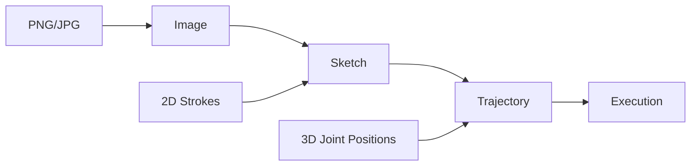

# Image to Trajectory

Learn how to convert images to robot drawing trajectories.

## Objectives

By the end of this tutorial, you will:

- Understand the image-to-trajectory pipeline
- Convert images to sketches (2D strokes)
- Generate robot trajectories using inverse kinematics
- Save and load trajectories
- Handle different image types

## Prerequisites

- pib3 installed with image support: `pip install "pib3[image] @ git+https://github.com/mamrehn/pib3.git"`
- A sample image to convert

---

## The Pipeline

Converting an image to a robot trajectory involves three stages:



1. **Image → Sketch**: Extract contours, simplify, normalize to 2D strokes
2. **Sketch → Trajectory**: Map 2D points to 3D space, solve inverse kinematics
3. **Trajectory → Execution**: Send joint positions to robot/simulator

---

## Quick Method

The simplest way to convert an image:

```python
import pib3

# One function does everything
trajectory = pib3.generate_trajectory("my_drawing.png")

# Save for later use
trajectory.to_json("output.json")
```

---

## Step-by-Step Method

For more control, use the step-by-step approach:

### Step 1: Load and Process Image

```python
import pib3

# Convert image to sketch (2D strokes)
sketch = pib3.image_to_sketch("my_drawing.png")

# Inspect the result
print(f"Number of strokes: {len(sketch)}")
print(f"Total points: {sketch.total_points()}")
print(f"Total length: {sketch.total_length():.2f}")
print(f"Bounding box: {sketch.bounds()}")
```

### Step 2: Inspect Individual Strokes

```python
# Look at each stroke
for i, stroke in enumerate(sketch):
    print(f"Stroke {i}: {len(stroke)} points, "
          f"length={stroke.length():.3f}, "
          f"closed={stroke.closed}")
```

### Step 3: Generate Trajectory

```python
# Convert to 3D robot trajectory
trajectory = pib3.sketch_to_trajectory(sketch)

print(f"Waypoints: {len(trajectory)}")
print(f"Success rate: {trajectory.metadata.get('success_rate', 0):.1%}")
```

### Step 4: Save the Trajectory

```python
# Save to JSON file
trajectory.to_json("my_trajectory.json")

# Load it back later
loaded = pib3.Trajectory.from_json("my_trajectory.json")
```

---

## Understanding Image Processing

### What Makes a Good Input Image?

| Good Images | Poor Images |
|-------------|-------------|
| High contrast | Low contrast |
| Black lines on white | Grayscale gradients |
| Simple shapes | Complex textures |
| Clear edges | Blurry edges |
| PNG with transparency | Compressed JPG artifacts |

### Example: Processing Different Image Types

```python
import pib3
from pib3 import ImageConfig

# For a clean black-on-white drawing
config = ImageConfig(
    threshold=128,
    auto_foreground=True,
)
sketch = pib3.image_to_sketch("clean_drawing.png", config)

# For a pencil sketch (lighter lines)
config = ImageConfig(
    threshold=200,  # More sensitive to light lines
    simplify_tolerance=3.0,  # More smoothing
)
sketch = pib3.image_to_sketch("pencil_sketch.jpg", config)

# For a detailed image (preserve details)
config = ImageConfig(
    simplify_tolerance=1.0,  # Less simplification
    min_contour_length=5,    # Keep smaller features
)
sketch = pib3.image_to_sketch("detailed.png", config)
```

---

## Working with Different Input Formats

### From File Path

```python
import pib3

# String path
sketch = pib3.image_to_sketch("drawing.png")

# Path object
from pathlib import Path
sketch = pib3.image_to_sketch(Path("images/drawing.png"))
```

### From NumPy Array

```python
import numpy as np
import pib3

# Grayscale array (height, width)
gray_image = np.zeros((100, 100), dtype=np.uint8)
gray_image[25:75, 25:75] = 255  # White square
sketch = pib3.image_to_sketch(gray_image)

# RGB array (height, width, 3)
rgb_image = np.zeros((100, 100, 3), dtype=np.uint8)
rgb_image[25:75, 25:75] = [255, 0, 0]  # Red square
sketch = pib3.image_to_sketch(rgb_image)

# RGBA with transparency
rgba_image = np.zeros((100, 100, 4), dtype=np.uint8)
rgba_image[25:75, 25:75] = [0, 0, 0, 255]  # Opaque black square
sketch = pib3.image_to_sketch(rgba_image)
```

### From PIL Image

```python
from PIL import Image
import pib3

# Open with PIL
pil_image = Image.open("drawing.png")

# Optionally process with PIL first
pil_image = pil_image.resize((200, 200))
pil_image = pil_image.rotate(45)

# Convert to sketch
sketch = pib3.image_to_sketch(pil_image)
```

---

## Tracking Progress

For large images or slow systems, track IK solving progress:

```python
import pib3

def progress_callback(current, total, success):
    """Called for each trajectory point."""
    percent = (current / total) * 100
    status = "✓" if success else "✗"
    print(f"\r[{percent:5.1f}%] Point {current}/{total} {status}", end="")

sketch = pib3.image_to_sketch("complex_drawing.png")
trajectory = pib3.sketch_to_trajectory(
    sketch,
    progress_callback=progress_callback
)
print()  # New line after progress
```

---

## Visualizing During Generation


!!! note
    Visualization slows down trajectory generation but helps debug IK issues.

---

## Grip Styles

The library supports two drawing grip styles:

### Pencil Grip (Default)

Uses a clenched fist holding a pencil, with the pencil tip near the base of the pinky. The IK solver maintains a vertical palm orientation to keep the pencil pointing down.

```python
import pib3

# Default - uses pencil grip
trajectory = pib3.generate_trajectory("drawing.png")
```

### Index Finger

Uses the extended index finger tip as the drawing tool:

```python
from pib3 import TrajectoryConfig, IKConfig

config = TrajectoryConfig(
    ik=IKConfig(grip_style="index_finger"),
)
trajectory = pib3.generate_trajectory("drawing.png", config=config)
```

| Grip Style | TCP Reference | Tool Offset | Orientation | Hand Pose |
|------------|---------------|-------------|-------------|-----------|
| `pencil_grip` (default) | Palm | ~80mm | Vertical palm enforced | Power grip (all fingers curled) |
| `index_finger` | Index finger tip | 27mm | Not constrained | Index extended, others curled |

---

## Complete Example

```python
"""
Complete image-to-trajectory example.
"""
import pib3
from pib3 import TrajectoryConfig, PaperConfig, ImageConfig, IKConfig

# Configure all parameters
config = TrajectoryConfig(
    # Paper/drawing surface
    paper=PaperConfig(
        size=0.15,           # 15cm x 15cm
        height_z=0.74,       # Table height in meters
        drawing_scale=0.85,  # Use 85% of paper
        lift_height=0.03,    # 3cm pen lift between strokes
    ),
    # Image processing
    image=ImageConfig(
        threshold=128,
        auto_foreground=True,
        simplify_tolerance=2.0,
        min_contour_length=10,
        optimize_path_order=True,  # Minimize pen travel
    ),
    # IK solver
    ik=IKConfig(
        max_iterations=150,
        tolerance=0.002,  # 2mm position tolerance
        arm="left",       # Use left arm
        # grip_style="pencil_grip" is the default
    ),
)

# Process image
print("Loading image...")
sketch = pib3.image_to_sketch("my_drawing.png", config.image)
print(f"Extracted {len(sketch)} strokes with {sketch.total_points()} points")

# Generate trajectory with progress
print("\nGenerating trajectory...")
def on_progress(current, total, success):
    if current % 50 == 0 or current == total:
        rate = current / total * 100
        print(f"  Progress: {rate:.0f}%")

trajectory = pib3.sketch_to_trajectory(
    sketch,
    config,
    progress_callback=on_progress
)

# Show results
print(f"\nTrajectory generated!")
print(f"  Waypoints: {len(trajectory)}")
print(f"  Success rate: {trajectory.metadata['success_rate']:.1%}")
print(f"  Failed points: {trajectory.metadata['fail_count']}")

# Save
trajectory.to_json("output_trajectory.json")
print(f"\nSaved to output_trajectory.json")
```

---

## Sequential Trajectories

When the robot needs to draw multiple images in sequence, each new trajectory should start from the end position of the previous one. Use the `initial_q` parameter:

### Basic Sequential Drawing

```python
import pib3

# First trajectory starts from default pose
traj1 = pib3.generate_trajectory("image1.png")

# Second trajectory starts from where first ended
traj2 = pib3.generate_trajectory("image2.png", initial_q=traj1)

# Third trajectory continues from second
traj3 = pib3.generate_trajectory("image3.png", initial_q=traj2)

# Execute all on robot
with pib3.Robot(host="172.26.34.149") as robot:
    robot.run_trajectory(traj1)
    robot.run_trajectory(traj2)
    robot.run_trajectory(traj3)
```

### Starting from Robot's Current Position

You can also start from the robot's current joint positions:

```python
import pib3

with pib3.Robot(host="172.26.34.149") as robot:
    # Get current joint positions
    current_joints = robot.get_joints(unit="rad")

    # Generate trajectory starting from current position
    trajectory = pib3.generate_trajectory(
        "drawing.png",
        initial_q=current_joints
    )

    robot.run_trajectory(trajectory)
```

### Using with Step-by-Step API

```python
import pib3

sketch1 = pib3.image_to_sketch("drawing1.png")
sketch2 = pib3.image_to_sketch("drawing2.png")

# First trajectory
traj1 = pib3.sketch_to_trajectory(sketch1)

# Second trajectory starts from first's end position
traj2 = pib3.sketch_to_trajectory(sketch2, initial_q=traj1)
```

### Supported Input Types for initial_q

| Type | Description |
|------|-------------|
| `Trajectory` | Uses the last waypoint from the trajectory |
| `np.ndarray` | Array of joint positions in radians (36 values for PIB) |
| `dict` | Dictionary mapping joint names to radian values |
| `None` | Default - uses fixed initial drawing pose |

---

## Troubleshooting

!!! warning "No strokes extracted from image"
    **Cause:** Image may be inverted or threshold is wrong.

    **Solution:**

    ```python
    config = ImageConfig(
        auto_foreground=True,  # Auto-detect foreground
        threshold=100,         # Try different values (0-255)
    )
    ```

!!! warning "Too many small strokes"
    **Cause:** Noise or small features being detected.

    **Solution:**

    ```python
    config = ImageConfig(
        min_contour_length=20,   # Filter small contours
        min_contour_points=5,    # Minimum points per stroke
        simplify_tolerance=3.0,  # More simplification
    )
    ```

!!! warning "Strokes are too simplified"
    **Cause:** `simplify_tolerance` is too high.

    **Solution:**

    ```python
    config = ImageConfig(
        simplify_tolerance=0.5,  # Less simplification
    )
    ```

!!! warning "IK success rate is low"
    **Cause:** Target positions may be outside robot reach.

    **Solution:**

    ```python
    config = TrajectoryConfig(
        paper=PaperConfig(
            size=0.10,           # Smaller drawing area
            drawing_scale=0.7,   # Use less of the paper
        ),
    )
    ```

!!! warning "RuntimeError: No successful IK solutions"
    **Cause:** Paper position is completely outside robot reach.

    **Solution:** Adjust paper position or let it auto-calculate:

    ```python
    config = TrajectoryConfig(
        paper=PaperConfig(
            center_y=None,  # Auto-calculate from robot reach
        ),
    )
    ```

---

## Next Steps


- [Controlling the Robot](controlling-robot.md) - Execute on hardware
- [Working with Sketches](working-with-sketches.md) - Modify sketches programmatically
- [Custom Configurations](custom-configurations.md) - All configuration options
