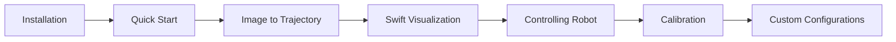

# Tutorials

Learn how to use pib3 effectively through step-by-step tutorials.

## Getting Started Tutorials

### [Image to Trajectory](image-to-trajectory.md)

Learn how to convert images to robot drawing trajectories. Covers image processing, contour extraction, and IK solving.

### [Controlling the Robot](controlling-robot.md)

Master the joint control API. Learn percentage-based control, pose saving/restoring, and verification.

### [Swift Visualization](swift-visualization.md)

Use browser-based 3D visualization. Run trajectories, use interactive mode, and add visual elements.

## Advanced Tutorials

### [Working with Sketches](working-with-sketches.md)

Manipulate sketches programmatically. Create, modify, and optimize strokes for better drawings.

### [Custom Configurations](custom-configurations.md)

Fine-tune all parameters. Configure paper size, IK solver, image processing, and more.

---

## Tutorial Structure

Each tutorial includes:

- **Objectives**: What you'll learn
- **Prerequisites**: What you need before starting
- **Step-by-step instructions**: With code examples
- **Complete examples**: Ready-to-run code
- **Troubleshooting**: Common issues and solutions

## Prerequisites

Before starting the tutorials, ensure you have:

1. [Installed pib3](../getting-started/installation.md) with the features you need
2. A basic understanding of Python
3. (For robot tutorials) Access to a PIB robot or willingness to use Swift visualization

## Suggested Learning Path

1. **Start here**: [Image to Trajectory](image-to-trajectory.md) - Core functionality
2. **Visualization**: [Swift Visualization](swift-visualization.md) - Test without hardware
3. **Robot Control**: [Controlling the Robot](controlling-robot.md) - When you have access
4. **Advanced**: [Custom Configurations](custom-configurations.md) - Fine-tune behavior
